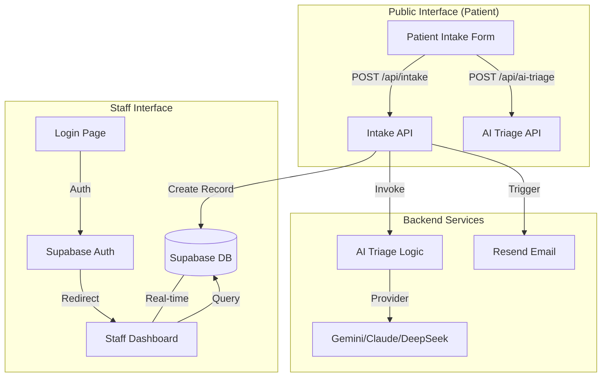

# City Care Hospital Automation MVP — Developer Guide

This guide provides a comprehensive overview of the architecture, data flow, and modification patterns for the City Care Hospital Clinical HIS & Patient Triage System.

## 🏗️ System Architecture

The project is built using a modern full-stack architecture centered around **Next.js 16**, **Supabase**, and **Generative AI**.

### Tech Stack
- **Framework**: Next.js 16 (App Router)
- **Language**: TypeScript
- **Styling**: Tailwind CSS 4
- **Database & Auth**: Supabase (PostgreSQL + GoTrue)
- **AI Engine**: Multi-provider support (Gemini 1.5 Flash, Claude 3.5, DeepSeek)
- **Email**: Resend
- **Icons**: Lucide React

---

## 📊 System Flow Diagram



---

## 📂 Project Structure

```text
├── app/
│   ├── api/                # Serverless API routes
│   │   ├── intake/         # Main patient submission handler
│   │   └── ai-triage/      # Standalone AI assessment endpoint
│   ├── staff/              # Protected staff portal
│   │   ├── login/          # Auth entry point
│   │   └── dashboard/      # Clinical management interface
│   ├── globals.css         # Tailwind styles
│   ├── layout.tsx          # Root layout with fonts
│   └── page.tsx            # Public landing page (Intake Form)
├── components/             # Reusable UI components
│   ├── PatientIntakeForm.tsx
│   ├── SymptomSelector.tsx
│   └── AppointmentSlotPicker.tsx
├── lib/                    # Core business logic & clients
│   ├── ai.ts               # AI provider abstraction & prompts
│   ├── supabase.ts         # Server-side admin client
│   ├── supabase-browser.ts # Client-side public client
│   ├── resend.ts           # Email integration
│   └── types.ts            # Global TypeScript definitions
├── public/                 # Static assets
└── schema.sql              # Database definitions (PostgreSQL)
```

---

## 🛠️ Modification Guide

### 1. Adding a New Database Table
1.  Add the `CREATE TABLE` statement to `schema.sql`.
2.  Update `lib/types.ts` to include the new interface.
3.  Run the SQL in your Supabase SQL Editor.

### 2. Modifying AI Triage Logic
The AI logic is centralized in `lib/ai.ts`.
- **To change the prompt**: Update the `prompt` string in `runAITriage`.
- **To add a provider**: Add the provider name to `AIProvider` type and implement the fetch logic in `runAITriage`.
- **To update mock responses**: Modify `getMockTriageResponse`.

### 3. Adding a New Department or Doctor
Departments and doctors are managed in the database.
- **Via SQL**: Add an `INSERT` statement in `schema.sql`.
- **Via Dashboard**: (Future) Create a UI in the Staff Portal to manage these records.
- **Note**: The `AppointmentSlotPicker` automatically fetches active departments and doctors from the `departments` and `doctors` tables.

### 4. Updating UI Styles
- This project uses **Tailwind CSS 4**.
- Global styles are in `app/globals.css`.
- Most components use a "Glassmorphism" or "Dark Mode" aesthetic using `bg-slate-900/60 backdrop-blur-xl`.

### 5. Environment Variables
When moving to production, ensure these are set in your hosting provider (e.g., Vercel):
- `AI_PROVIDER`: Set to `gemini`, `anthropic`, or `deepseek`.
- `NEXT_PUBLIC_SUPABASE_URL` & `NEXT_PUBLIC_SUPABASE_ANON_KEY`: From Supabase project settings.
- `SUPABASE_SERVICE_ROLE_KEY`: **CRITICAL** for server-side operations (keep secret).
- `RESEND_API_KEY`: For email notifications.

---

## 🚀 Development Workflow

1.  **Local Dev**: `npm run dev`
2.  **Docker Local**: 
    - Ensure `.env.local` is present.
    - Run `docker-compose up --build`
    - Access at `http://localhost:3000`
3.  **Type Checking**: `npx tsc --noEmit`
3.  **Database**: Apply `schema.sql` to a fresh Supabase project to replicate the environment.
4.  **Auth**: Enable Email/Password provider in Supabase Auth settings.

---

## 📝 Key Design Patterns

- **Admin Client vs. Browser Client**: 
    - Use `lib/supabase-browser.ts` for client-side queries (respects RLS).
    - Use `lib/supabase.ts` (admin client) in API routes for operations that bypass RLS (like creating patient records from a public form).
- **Graceful Fallbacks**: 
    - If AI keys are missing, the system falls back to a rule-based mock triage.
    - If Resend is not configured, emails are logged to the console.
- **Atomic Intake**: 
    - The `/api/intake` route performs three actions: creates the patient, schedules the appointment, and runs the AI triage in a single request flow.
